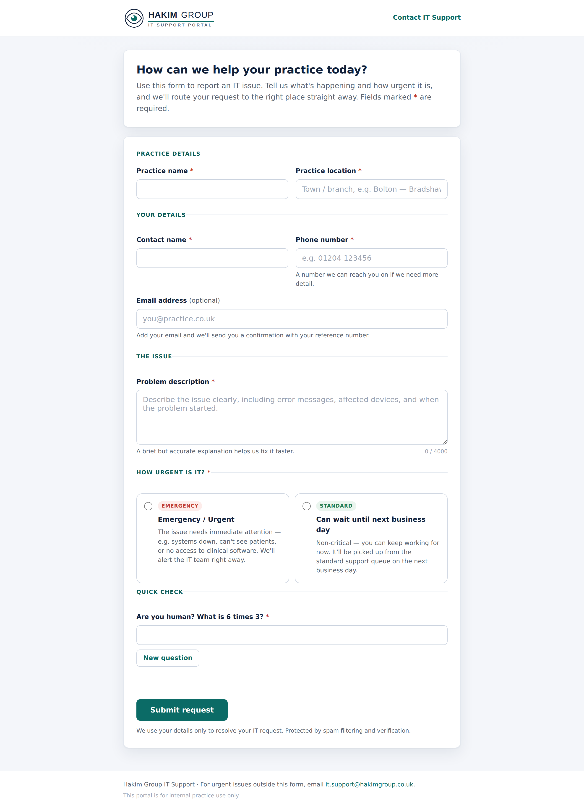

# M365 Leave Visibility

An Outlook add-in for **tenant-wide employee leave visibility**, integrated with
**iTrent** HR. It shows which colleagues are currently on leave directly inside
Outlook — when you read an email, or as you compose one to them — so you know
before you hit send whether a recipient is away.

> Powered by iTrent HR data, surfaced through Microsoft 365 / Microsoft Graph.

---

## Features

- 🟢 **At-a-glance status** — see each message recipient's leave status (in /
  out of office, returning date) in the Outlook task pane.
- ✉️ **Read & compose aware** — activates on both reading and composing mail.
- 🔄 **Scheduled sync** — pulls leave records from iTrent on a cron schedule and
  caches them for fast lookups.
- 🔐 **SSO** — single sign-on via Microsoft Entra ID (Azure AD); no separate login.
- 🧪 **Dev mode** — run the whole thing locally with mock data, no Azure or iTrent
  required (see [`docs/LOCAL_TESTING.md`](docs/LOCAL_TESTING.md)).
- 🎫 **IT Support Portal** — a bundled, responsive intake form for practice staff
  to log IT issues. Urgent tickets are emailed to IT and raised in Microsoft
  Teams; routine ones go to the standard queue (see
  [`docs/SUPPORT_PORTAL.md`](docs/SUPPORT_PORTAL.md)).

## Architecture

| Layer | Tech | Location |
|-------|------|----------|
| **Add-in (frontend)** | TypeScript, React 18, Fluent UI v9, Office.js, MSAL Browser, webpack | [`src/`](src/) |
| **Backend API** | Node/Express (TypeScript), Microsoft Graph, MSAL Node, JWT/SSO auth | [`server/`](server/) |
| **Scheduled sync** | Azure Function (timer-triggered) | [`server/azure-function-sync/`](server/azure-function-sync/) |
| **Data store** | Azure Cosmos DB (prod) · in-memory cache (dev) | — |
| **Manifest** | Office Add-in manifest (Mailbox host) | [`manifest.xml`](manifest.xml) |

```
Outlook ──▶ Add-in task pane (src/) ──▶ Backend API (server/) ──▶ leave cache
                                                  ▲
                          iTrent HR ──▶ sync service / Azure Function
```

## IT Support Portal

A bundled, public-facing intake form ([`support-portal/`](support-portal/))
served by the same backend. Practice staff log an IT issue and pick its urgency;
the API validates + de-spams the submission, stores it, and routes it:

- **Emergency / Urgent** → high-priority email to `it.support@hakimgroup.co.uk`
  **and** a Microsoft Teams alert.
- **Can wait until next business day** → standard support queue, normal priority.

Responsive, accessible, CAPTCHA-protected, and confirmation-emails the requester.
Run it locally with `DEV_MODE=true npm run dev:server` then open
<http://localhost:3001/>. Full guide: [`docs/SUPPORT_PORTAL.md`](docs/SUPPORT_PORTAL.md).



## Project structure

```
src/
  taskpane/        Task pane React UI (LeaveCard, LeaveStatusBanner, Settings, …)
  commands/        Event-based command handlers
  shared/          Auth config, constants, shared types
server/
  src/routes/      auth · leave · sync · tickets
  src/services/    graphService · itrentService · leaveStatusService · syncService ·
                   notificationService · ticketService · ticketValidation ·
                   captchaService · teamsWebhookService · supportEmailService
  src/data/        leaveCache · ticketStore · mockData
  azure-function-sync/  Timer-triggered iTrent sync
support-portal/    Static IT Support Portal frontend (HTML/CSS/JS, served by the API)
deploy/            Azure deployment script
docs/              Local testing guide · IT Support Portal guide
```

## Prerequisites

- Node.js 18+
- A Microsoft 365 tenant and an Entra ID app registration (for production / SSO)
- Access to an iTrent instance (for production data; not needed in dev mode)

## Quick start (local dev mode)

No Azure or iTrent setup needed — dev mode serves mock data and a mock Office
runtime so the task pane renders in a normal browser tab.

```bash
# 1. Install dependencies
npm install
npm --prefix server install

# 2. Create your .env (the template already has DEV_MODE=true)
cp .env.example .env

# 3. Start the backend API (terminal 1)  → http://localhost:3001
npm run dev:server

# 4. Start the add-in dev server (terminal 2) → https://localhost:3000
npm start
```

Full walkthrough: [`docs/LOCAL_TESTING.md`](docs/LOCAL_TESTING.md).

## Configuration

Copy [`.env.example`](.env.example) to `.env` and fill in values as needed:

- **Entra ID** — `AZURE_TENANT_ID`, `AZURE_CLIENT_ID`, `AZURE_CLIENT_SECRET`
- **iTrent** — `ITRENT_BASE_URL`, auth method + credentials (leave blank in dev mode)
- **Cosmos DB** — connection settings for the production leave store
- **`DEV_MODE`** — `true` for local testing; **never** enable in production

Before deploying, replace the placeholders in `manifest.xml`
(`{{ADDIN_GUID}}`, `{{ADDIN_URL}}`, `{{CLIENT_ID}}`, `{{TENANT_ID}}`).

## Scripts

| Command | Description |
|---------|-------------|
| `npm start` | Run the add-in dev server (webpack) |
| `npm run build` | Build the add-in for production |
| `npm run build:all` | Build add-in **and** server |
| `npm run dev:server` | Run the backend API in watch mode |
| `npm run lint` | Lint the add-in source |
| `npm test` | Run tests (Jest) |
| `npm run validate-manifest` | Validate `manifest.xml` |

## Deployment

Production hosting targets Azure. See [`deploy/azure-deploy.sh`](deploy/azure-deploy.sh)
for the deployment script and `.env.example` for the required production settings.
A production build (`NODE_ENV=production`) never mocks Office, bypasses auth, or
serves mock data.

## Author

**Oluoshadare Olumide** ([@oluoshadareolumide](https://github.com/oluoshadareolumide))

## License

Private and internal — all rights reserved.
