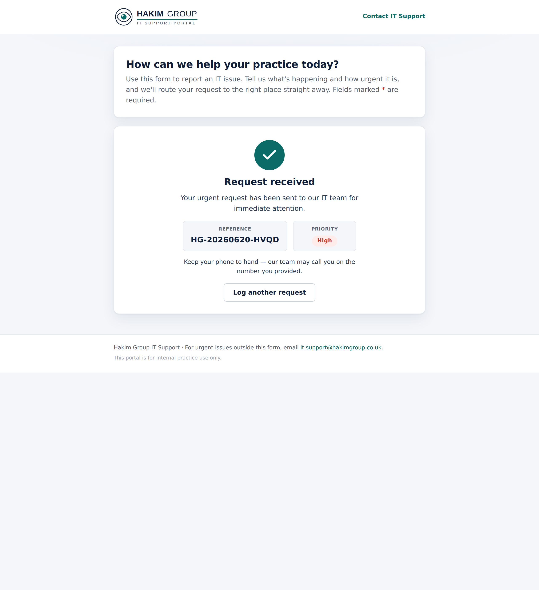
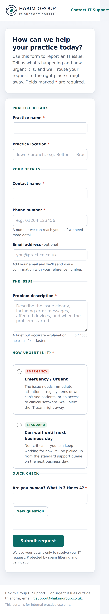

# IT Support Portal

A lightweight, professional **IT support intake portal** for Hakim Group
practice staff. Staff describe an issue, choose how urgent it is, and the portal
routes the ticket automatically — urgent issues are emailed to the IT team and
raised in Microsoft Teams; routine issues go to the standard support queue.

It is bundled with the M365 Leave Visibility backend: the same Node/Express API
serves the portal's static frontend and its ticket API, so there is one thing to
deploy.

| Support request form | Confirmation state | Responsive (mobile) |
|---|---|---|
|  |  |  |

> **Branding note:** `support-portal/assets/logo.svg` is an **original wordmark**
> created for this project, inspired by the clean Hakim Group style — it is *not*
> the official logo. Swap in the licensed brand asset before customer-facing use.

---

## What it does

**Form fields** (all required unless noted)

- Practice name
- Practice location
- Contact name
- Phone number
- Email address *(optional — drives the confirmation email)*
- Problem description — with the prompt *"Describe the issue clearly, including
  error messages, affected devices, and when the problem started."*
- **Urgency** — one of:
  - **Emergency / Urgent** — needs immediate attention
  - **Can wait until next business day** — non-critical

### Routing logic

| Urgency chosen | Priority | Routed to | Teams alert | Confirmation to requester |
|----------------|----------|-----------|:-----------:|:-------------------------:|
| Emergency / Urgent | **High** | `SUPPORT_EMAIL` (high-importance email) | ✅ | ✅ (if email given) |
| Can wait until next business day | Normal | standard support queue (normal email) | — | ✅ (if email given) |

Every ticket is given a reference like `HG-20260620-7F3K`, persisted, and shown
back to the user on success.

---

## Security & spam protection

The portal is a **public** form, so it is hardened accordingly:

- **CAPTCHA** — by default a server-issued arithmetic challenge. The operands are
  signed into an opaque, **time-limited, single-use** HMAC token, verified with a
  timing-safe comparison. No third-party calls, works offline, and is accessible
  (plain-text question, screen-reader friendly). Cloudflare Turnstile, Google
  reCAPTCHA and hCaptcha are also supported (see config).
- **Honeypot** field + **submit-timing trap** catch naive bots without bothering
  humans.
- **Rate limiting** — 8 submissions/min/IP on the submit endpoint, 30/min on the
  CAPTCHA endpoint (plus the global API limiter).
- **Server-side validation** of every field is the real boundary — the browser's
  checks are only for UX. Inputs are length-bounded and control characters
  stripped.
- **Output encoding** — user content is HTML-escaped in emails; Teams Adaptive
  Cards render text (not HTML), so markup cannot be injected.
- **Secrets** (HMAC secret, SMTP creds, Teams URL) come from the environment and
  are never logged. Tickets are captured to the store *before* any notification
  is attempted, so a notification failure never loses a request.
- **No new attack surface for the add-in** — the portal posts only to its own
  public endpoints; it never touches the tenant's Graph permissions.

---

## Configuration

All settings live in `.env` (see [`.env.example`](../.env.example) for the full,
commented list). The essentials:

| Variable | Purpose | Default |
|----------|---------|---------|
| `SUPPORT_PORTAL_ENABLED` | Master on/off switch | `true` |
| `SERVE_PORTAL` | Serve the static frontend from the API | `true` |
| `SUPPORT_EMAIL` | Mailbox tickets are routed to | `it.support@hakimgroup.co.uk` |
| `CAPTCHA_PROVIDER` | `builtin` \| `turnstile` \| `recaptcha` \| `hcaptcha` | `builtin` |
| `CAPTCHA_SECRET` | HMAC secret for builtin challenges (**required in prod**) | dev fallback |
| `TEAMS_WEBHOOK_URL` | Power Automate / connector webhook for urgent alerts | *(blank → logged)* |
| `SMTP_HOST` … `MAIL_FROM` | SMTP transport for email | *(blank → logged)* |
| `TICKET_STORE_BACKEND` | `file` \| `cosmos` \| `memory` | `file` |
| `ADMIN_API_KEY` | Guards `GET /api/tickets`; blank disables it | *(off)* |

When a notification channel isn't configured (e.g. local dev), the message is
**logged** instead of sent, so the whole flow still works end-to-end with zero
external setup.

---

## Running locally

No Azure, SMTP or Teams setup needed — dev mode logs notifications.

```bash
npm --prefix server install
DEV_MODE=true npm run dev:server      # API + portal on http://localhost:3001
```

Open <http://localhost:3001/> and submit a test ticket. You'll see the routing,
the (logged) email + Teams alert, and the stored record in
`server/data/tickets.jsonl`.

---

## API reference

Base path `/api/tickets` (same origin as the portal).

| Method & path | Auth | Purpose |
|---------------|------|---------|
| `GET /config` | public | Frontend config (CAPTCHA provider, support email) |
| `GET /captcha` | public | Issue a CAPTCHA challenge → `{ token, question, provider }` |
| `POST /` | public | Submit a ticket (anti-spam guarded) |
| `GET /?limit=` | `x-admin-key` | List recent tickets (disabled unless `ADMIN_API_KEY` set) |

**Submit body**

```json
{
  "practiceName": "Riverside Opticians",
  "practiceLocation": "Manchester — Didsbury",
  "contactName": "Priya Patel",
  "phone": "0161 555 7788",
  "email": "priya@riverside.example",
  "problemDescription": "Card terminal offline and EMIS won't load…",
  "urgency": "emergency",
  "captchaToken": "<from /captcha>",
  "captchaAnswer": "7",
  "website": "",
  "formLoadedAt": 1718890000000
}
```

**Success** `201` → `{ reference, priority, urgency, message }`.
**Errors** `400` → `{ code, message, errors: [{ field, message }] }`
(`VALIDATION_FAILED` · `CAPTCHA_FAILED` · `SPAM_DETECTED`), `429` `RATE_LIMITED`.

---

## Deployment notes

**Microsoft Teams alerts** — create a Power Automate flow with the *"When a Teams
webhook request is received"* trigger (the supported replacement for retiring
Office 365 connector webhooks), add a *"Post card in a chat or channel"* action,
and paste the generated URL into `TEAMS_WEBHOOK_URL`. The portal posts an
Adaptive Card in the standard `{ type: "message", attachments: [...] }` envelope.

**Email** — point `SMTP_*` at your relay (e.g. Microsoft 365 SMTP / SendGrid).
Urgent tickets are sent high-importance (`X-Priority: 1`).

**Storage** — `file` (JSONL) is fine for a single instance; for multi-instance /
HA, set `TICKET_STORE_BACKEND=cosmos` to reuse the configured Cosmos DB account
(container `support-tickets`).

**Hosting the portal separately** — set `SERVE_PORTAL=false`, host
`support-portal/` on Azure Static Web Apps / SharePoint, point its `<body
data-api-base>` at the API, and add that origin to `PORTAL_BASE_URL`.

**Third-party CAPTCHA** — the bundled strict CSP allows only same-origin scripts.
If you switch `CAPTCHA_PROVIDER` to Turnstile/reCAPTCHA/hCaptcha, relax the API's
`helmet` CSP to allow that provider's script + frame, and add its widget loader
to the portal.
